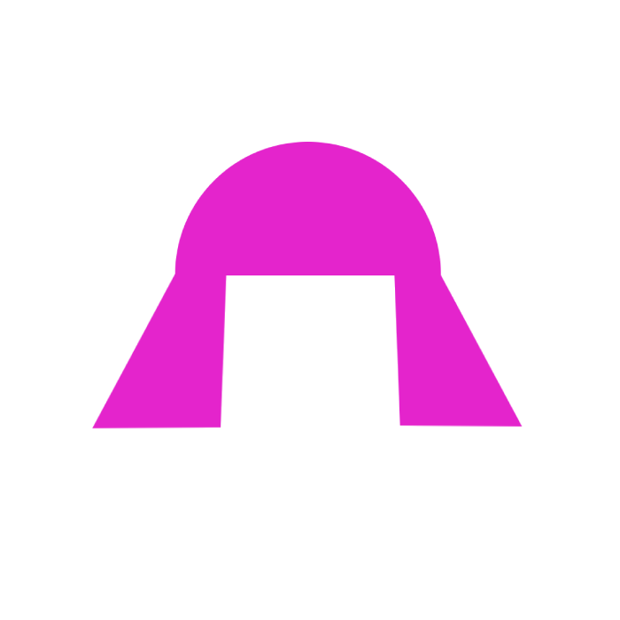

<div align="center">



<h1>amy</h1>

<p><strong>Leave it running.</strong><br>
<em><strong>A</strong>utomate <strong>MY</strong> work</em></p>

<p>
  <a href="LICENSE"></a>
  <a href="https://github.com/nicolasmelo1/amy/actions/workflows/software-factory.yml"></a>
  
  
  
  
</p>

<p>
  <a href="docs/start/quickstart.md"><strong>Quickstart</strong></a> ·
  <a href="docs/">Documentation</a> ·
  <a href="docs/build/write-a-workflow.md">Write a workflow</a> ·
  <a href="docs/build/write-a-plugin.md">Write a plugin</a> ·
  <a href="docs/changelog/">News</a>
</p>

</div>

---

**Leave it running, and it does the long part of your work while you are
somewhere else — built the way *you* work, not the way somebody else does.**

## What it is, in a minute

You pick up a ticket. Writing the code is not the hard part any more — an
agent is already good at that. The long part is everything *around* it:

> read the ticket → ask when something is unclear → do the work → run the
> checks → open the pull request → answer the review bot → pick a reviewer →
> deal with their comments → hand it to QA

That takes days, and most of it is waiting on other people. amy is a small
machine that sits there and walks it one step at a time, so you stop having to
hold it in your head.

```sh
amy start                            # off it goes, in the background
amy status                           # where everything stands
amy btw "bump the deps in the api"   # something you thought of in passing
```

## The part that makes it different

**That process above is not baked in.** It is one *workflow*, and a workflow
is just a small package you can read in one sitting. It says two things: what
happens next, and how each step is done.

Your team does not work like mine. A tool that ships somebody else's process
is a tool that is *nearly* right for you, and nearly-right is where automation
goes to be abandoned. So amy ships the machine, and **you assemble the process
before you use it.**

Three come in the box, and you can write a fourth in an afternoon:

| | |
| :-- | :-- |
| **ticket-to-qa** | a tracker ticket, all the way to a QA handoff |
| **note-to-plan** | friction amy hit becomes a written plan in the right repo |
| **errand** | something you said in passing becomes a pull request |

The bits underneath are swappable too, not just the process. The thing that
talks to your tracker, the thing that opens pull requests, the agent it asks,
where it writes things down, how it reaches you — every one of those is a
plugin, and changing one is a line of config. Nothing here is welded shut.

→ [Overview](docs/start/overview.md) · [Workflows and profiles](docs/start/workflows-and-profiles.md)

## It lives *under* your tools, not inside one

amy is installed once on your machine and keeps running on its own. Claude
Code, Codex, Hermes, a terminal, your phone at 2am — those are all just doors
into the same machine.

```text
   Claude Code      Codex       Hermes       your terminal
        └──────────────┴───────────┴──────────────┘
                            amy
              one install, one memory, always up
```

Close the laptop lid and it keeps its place. Ask from a different app tomorrow
and you get the same answer, because the state belongs to amy and not to the
conversation you happened to be having.

And it is open source, because a machine that runs *your* process is a machine
you have to be able to read.

## Five minutes

```sh
npm run install:local     # packs every package, installs to ~/.local/bin/amy
amy init                  # writes ~/.amy/config.yaml and ~/.amy/roster.yaml
amy doctor                # every dependency, checked before it touches a ticket
amy discover && amy tick  # exactly one move, then exit
```

`tick` is the whole product in one command. Run it until you trust it, then
`amy start --every 60` leaves the loop running in the background.

→ [Quickstart](docs/start/quickstart.md) · [Installation](docs/start/installation.md) · [Configuration](docs/start/configuration.md)

## The one idea

```ts
plan(record, observation, policy): Plan
```

The decision is a **pure function**. It reads a persisted record and a snapshot
of the outside world, and returns one of four things: `act`, `advance`, `wait`
or `settled`. It touches no tracker, no code host, no repository and no agent.

Effects are only ever *described* by the machine and *executed* by the worker,
so what the machine decided and what the world did stay separable — which is
why a sixteen-state lifecycle is walked end to end in a test with no I/O at
all, including the paths where a review requests changes and where the agent
disagrees with a reviewer.

Everything hard in this repository is downstream of keeping that function pure.

→ [Workflows](docs/concepts/workflows.md) · [The engine](docs/concepts/the-engine.md) · [Architecture](docs/concepts/architecture.md)

## Everything is a plugin

The core owns no domain. It owns the **catalogue of actions** that can be
taken, how each one is dispatched, the generic work record, the plan, and the
registry that mounts everything else. A state is a string to it and an action
is a name.

```text
@amykit/core
  actions:  triage, implement, run-gate, draft-plan, open-pull-request,
            address-threads, assign-reviewer, request-rereview, escalate,
            hand-off-to-qa, announce    each declares the port it needs
  ports:    Queue, Store, Notifier, EventLog, Budget, StopSwitch,
            CodeHost, Harness           none of them names a domain
  contract: Workflow + WorkflowRuntime  what an engine drives, generically
      ▲                                          ▲
      │ composes actions                         │ implements ports
      │                                          │
  the workflows                            the adapters
  ticket-to-qa, note-to-plan, errand       linear, github, claude, codex,
  a pure plan() and a runtime each         hermes, agent-relay, file-*, …
      │
      ▼
@amykit/plugin-serial-engine
  a queue, a budget, a retry count and a stop switch — and no idea what a
  ticket or a plan is
```

Plugins are **loaded from the config and assembled**, not constructed by the
CLI. `mount()` refuses, at boot and by name, a plugin that will not import, a
setting that is not one it declared, two plugins claiming the same port, and
an action the workflow emits that nothing can run. Removing the agent plugin
does not produce a crash three layers deep; it produces three lines naming
the three actions that would have failed.

→ [Plugins and the registry](docs/concepts/plugins.md) · [Ports](docs/concepts/ports.md) · [Actions](docs/concepts/actions.md)

## Make it yours

The point is the ones that cannot be shared. A process that names your
employer's tooling, a private feedback step, an on-call rota: those live in a
package of yours, versioned wherever you like, and amy mounts them exactly the
way it mounts its own.

```yaml
# ~/.amy/config.yaml
workflows:
  oncall:
    workflow: "@acme/workflow-oncall"    # a package this repository never shipped
```

```sh
npm install -g @acme/workflow-oncall
amy --workflow oncall start
```

| | |
| :-- | :-- |
| [**Write a workflow**](docs/build/write-a-workflow.md) | Your process. A pure `plan()`, a runtime, and the walkthrough test that is the only real proof. |
| [**Write a plugin**](docs/build/write-a-plugin.md) | An adapter for a tool amy has never heard of, with every failure mode named. |
| [**Testing**](docs/build/testing.md) | The three levels, and what each one is blind to. |
| [**Publishing**](docs/build/publishing.md) | Getting it installable, findable and listed. |

There is a complete third-party workflow in this repository that a gate installs
onto a machine with no checkout on it and drives, to prove exactly this —
[`workflow-oncall/index.js`](.software-factory/evidence/installed-plugins/workflow-oncall/index.js).

`/amy-workflow` designs one by interrogating you a question at a time.

## Documentation

Everything is in [`docs/`](docs/), and **half of it is generated from the code
on every build.** Any table of commands, settings, ports, actions, events,
states, gates or rules was read out of the thing it describes; `npm run gate`
goes red when the two disagree.

| | |
| :-- | :-- |
| [Start here](docs/start/overview.md) | Overview, quickstart, installation, configuration, running it, security |
| [How it works](docs/concepts/architecture.md) | Architecture, workflows, plugins, ports, actions, the queue, the engine, budgets, harnesses, events |
| [Build your own](docs/build/write-a-plugin.md) | Write a plugin, write a workflow, testing, publishing |
| [Reference](docs/reference/cli.md) | CLI, plugins, workflows, contracts, events, configuration — all generated |
| [Packages](docs/catalog/) | What is in the box, and how to get yours listed beside it |
| [News](docs/changelog/) | What shipped, and what is about to |
| [Development](docs/development/contributing.md) | Contributing, the gate, releasing, how the docs generate themselves |

→ [How the documentation generates itself](docs/development/documentation.md)

## Commands

`--workflow <name>` before any of them chooses which profile it drives. The
full reference, with every option and default, is
[in the docs](docs/reference/cli.md).

| Command | What it does |
| :-- | :-- |
| `amy init` | Write the config and roster templates. |
| `amy doctor` | Check everything it depends on. Exits non-zero when something is wrong. |
| `amy discover` | Put every piece of work the workflow can find onto the queue. |
| `amy tick` | Advance one piece of work by one move. |
| `amy run` | Keep advancing until nothing is due, then exit. `--max N`. |
| `amy start` / `amy stop` | The loop, in the background. `--every <seconds>`. |
| `amy pause` / `amy resume` | The handbrake. Ends work in flight, starts nothing new. |
| `amy status` | Where everything stands, the queue, the loop. `--json`. |
| `amy note "<text>"` | Write a piece of friction down and queue it. |
| `amy btw "<text>"` | Something to do, said in passing. Queued as an errand, never a ticket. |
| `amy workflow` / `amy plugin` | What this install can drive, and what it mounts. |
| `amy skills` | Install the skills into the harnesses on this machine. |
| `amy budget` | What the agents have spent, against the ceiling. |
| `amy roster` | Who is reviewing today. |
| `amy queue` | Tidy the queue; return what a dead worker left. |
| `amy models` | What each model is believed to cost. |

## One gate, and it is proven

```sh
npm run gate
```

That is the whole definition, in one place: build, typecheck, release config,
the documentation drift check, tests with a coverage floor, lint, a dead-code
detector, a dependency audit, `sf check` and `sf verify`. If it is not in
there it is not gated.

This repository runs [software factory](https://github.com/nicolasmelo1/software-factory)
on itself: **33 rules, and `sf verify` proves every one of them fires against
a deliberately broken fixture.** So the tool that refuses to open a pull
request until a gate is green is itself held to a gate that is proven to work.

Seven **gates** each pin a claim to a scenario that drives the *built artifact*
from another process, with the evidence sealed by digest — and touching the
code a gate covers expires its proof, because the last run proved something
that no longer exists.

→ [The gate](docs/development/the-gate.md) · [Testing](docs/build/testing.md)

## Contributing

[`CONTRIBUTING.md`](CONTRIBUTING.md) — the five minutes before your first
change, what has to be green, and the one architectural rule everything else
follows from. The longer version is
[in the docs](docs/development/contributing.md).

## License

MIT
