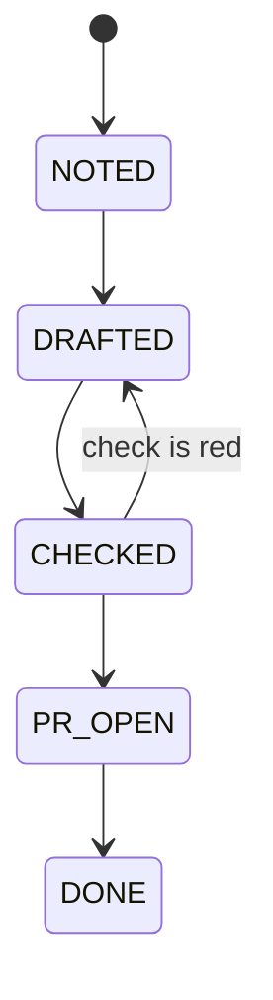

# Showing a workflow

Ask which workflow if it is not obvious — `amy workflow list` names them — and
then get the facts before drawing anything:

```sh
amy --workflow <name> status --json
```

That carries the states, which of them are waiting states, the terminal ones,
every record with its history, the queue, and whether the loop is running.

**Pick the smallest view that makes the point.** Skip the preamble. Most
questions about a workflow are answered by twenty lines of text, and a page
that has to be opened is a worse answer than one already on the screen.

## The forms, in order of preference

**A state machine as a line**, when it is mostly linear — which most are:

```text
NOTED ──► DRAFTED ──► CHECKED ──► PR_OPEN ──► DONE
             ▲            │
             └────────────┘
              the check is red
```

**One record's path**, when the question is "why is this stuck". Take
`history` from the JSON and mark where it sits:

```text
PROJ-1239
  NOTED      2026-09-04T20:01Z  picked up
  DRAFTED    2026-09-04T20:04Z  the agent wrote it
  CHECKED    2026-09-04T20:09Z  sf check was green
▶ PR_OPEN    2026-09-04T20:10Z  waiting: nobody has reviewed  (3 days)
```

**A count by state**, when there are many records and the question is "where
is everything":

```text
DRAFTED   ██████ 6
CHECKED   ██ 2
PR_OPEN   ███████████ 11   ← waiting
DONE      ███ 3
```

**Mermaid**, when the branching is the point and ASCII would lie about it:



**A diff**, when the point is what is *changing* — which is what
`/amy-workflow` needs every round:

```diff
 paged ──► triaged ──► acting ──► resolved
             │
+            ├──(3 failed tries)──► stuck
```

## When to write a page instead

Only when text genuinely cannot carry it: dozens of records at once, several
workflows side by side, or a shape whose branching Mermaid cannot lay out
readably.

Then write **one standalone HTML file** — no build step, no CDN, no
framework — into `~/.amy/reports/`, and open it:

```
Bash(open ~/.amy/reports/workflow-oncall.html)
```

Three rules for that page, and they are not decoration:

1. **Stamp it.** A dashboard of a live queue is wrong the moment a tick runs.
   Put the timestamp from `at` at the top, and the exact command that
   regenerates it, so nobody mistakes a snapshot for a window.
2. **Real labels and real data.** The state names the workflow actually
   declares, the ids actually on disk. No placeholder rows.
3. **Readable at both sizes**, light and dark, and legible on a phone —
   because the person asking is often the one who got the notification.

Overwrite the same filename per workflow. A directory of forty timestamped
files is not history, it is litter; the log is the history.

## What to say alongside

One or two sentences, not a report. The three things worth saying, when they
are true:

- **what is waiting on a human**, because that is the only thing the person
  reading can act on
- **what has been in one state a long time**, from `updatedAt` — a workflow
  that is stuck rarely says so, it just stops moving
- **what the loop is doing**: running, not running, or paused, from `loop` and
  `paused`

If the mount failed, `mounted` is false and `problems` says why. Show that
first and stop — a picture of a machine that will not start is a picture of
nothing.
